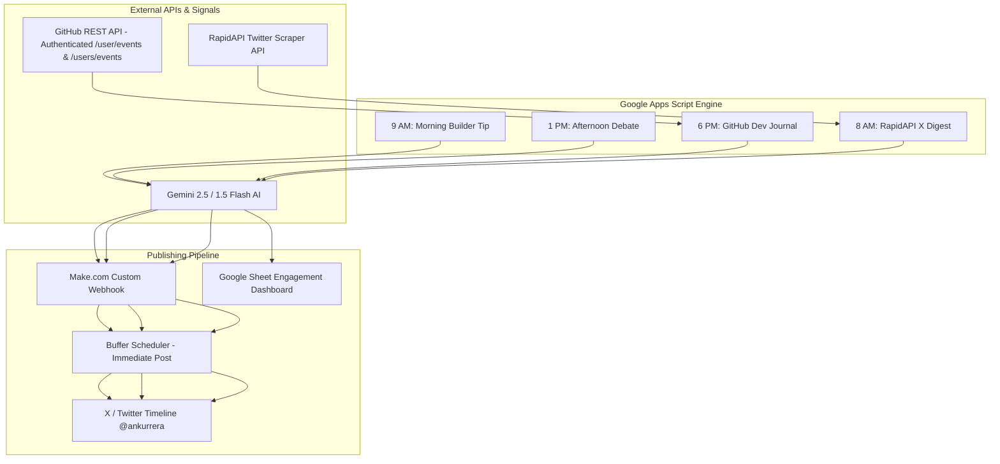

# 🚀 X (Twitter) Autonomous Creator & Dev Journal

An all-in-one automated social media engineering platform built on **Google Apps Script** for **[@ankurrera](https://x.com/ankurrera)**. 

It powers daily AI tech content creation, interactive community debates, automated GitHub development journaling (inspired by the indie hacker aesthetic of **[@buildwithsid](https://x.com/buildwithsid)**), and target developer engagement logging.

---

## 🏗️ Architecture Flow



---

## ✨ Features & Daily Schedule

### 1. 🌅 Morning Builder Tip (`generateAndPostAITweet`) — 9:00 AM IST
* **Style**: Inspired by **[@buildwithsid](https://x.com/buildwithsid)** — aesthetic, high-value, full-stack indie hacker insights.
* **Topics**: Next.js Server Actions, Framer Motion 60fps micro-animations, Tailwind UI hacks, TypeScript architecture, and indie shipping stacks.
* **Format**: Scroll-stopping hook + 2-3 punchy technical insights (authentic human tone, zero hashtags, zero bot fluff).

### 2. ☀️ Afternoon Builder Debate (`generateAndPostInteractiveTweet`) — 1:00 PM IST
* **Style**: Short, punchy, conversational tech choices and polls designed to drive comment replies (the highest-ranking metric in the X algorithm).
* **Themes**: Next.js App Router vs Pages Router, Vercel vs Self-hosting, Tailwind vs Styled Components, Supabase vs Postgres.

### 3. 🌇 Evening GitHub Dev Journal (`runGitHubDevJournal`) — 6:00 PM IST
* **Style**: Automated proof-of-work "Shipped Today" dev log.
* **Action**: Connects to the GitHub API via Personal Access Token (`GITHUB_TOKEN`), checks `/user/events` for commits/PRs/releases/new repos across private, public, and organization repos, filters out trivial commits (`typo`, `lint`, `bump`), and uses Gemini AI to synthesize meaningful progress into a single post.
* **Fallback Guarantee**: If no code was pushed that day, it automatically generates a high-value "Deep Work / Code Refactoring / Architecture Polish" log so daily posting NEVER halts.

### 4. 🎯 Target Account Engagement Digest (`generateXEngagementReplies`) — 8:00 AM IST
* **Action**: Uses **RapidAPI Twitter API** to fetch live tweets posted within the **last 48 hours** from target tech creators (`@levelsio`, `@dhh`, `@shl`, `@Nutlope`, `@rauchg`, `@leeerob`).
* **Output**: Logs the tweet content, direct `x.com` status URL, and a Gemini AI-drafted reply directly into your **[Google Sheet](https://docs.google.com/spreadsheets/d/1Y6s1Cw_FnJJpHaLqs2GuCqJruxlCPDee9q-PchI-8t0/edit)** for 1-click review and reply.

---

## ⚙️ Setup & Credentials

### Key Configuration in `Code.gs` & `TrendsDigest.gs`:

```javascript
const GEMINI_API_KEY  = "YOUR_GEMINI_API_KEY";
const MAKE_WEBHOOK_URL = "https://hook.eu1.make.com/p54kwt8ljwcny2lj2qowpvbq9kmq17j3";
const GITHUB_USERNAME  = "ankurrera";
const GITHUB_TOKEN     = "YOUR_GITHUB_PERSONAL_ACCESS_TOKEN";
const RAPIDAPI_KEY     = "YOUR_RAPIDAPI_KEY";
const SPREADSHEET_ID   = "1Y6s1Cw_FnJJpHaLqs2GuCqJruxlCPDee9q-PchI-8t0";
```

---

## ⏰ Apps Script Trigger Configuration

In your Google Apps Script project, navigate to **Triggers (⏰)** and add the following 4 time-driven triggers:

| Function | Event Source | Time Trigger | Time of Day |
| :--- | :--- | :--- | :--- |
| **`generateAndPostAITweet`** | Time-driven | Day timer | **9am to 10am** |
| **`generateAndPostInteractiveTweet`** | Time-driven | Day timer | **1pm to 2pm** |
| **`runGitHubDevJournal`** | Time-driven | Day timer | **6pm to 7pm** |
| **`generateXEngagementReplies`** | Time-driven | Day timer | **8am to 9am** |

---

## 🛡️ Webhook Payload & Buffer Compatibility

To prevent Make.com & Buffer `BundleValidationError: Missing value of required parameter 'text'`, the webhook payload sends sanitized text across standard parameter aliases:
```json
{
  "text": "Shipped a backend optimization today ⚡️...",
  "content": "Shipped a backend optimization today ⚡️...",
  "status": "Shipped a backend optimization today ⚡️...",
  "tweet": "Shipped a backend optimization today ⚡️...",
  "message": "Shipped a backend optimization today ⚡️..."
}
```

---

*Maintained by Ankur Bag ([@ankurrera](https://x.com/ankurrera)).*
